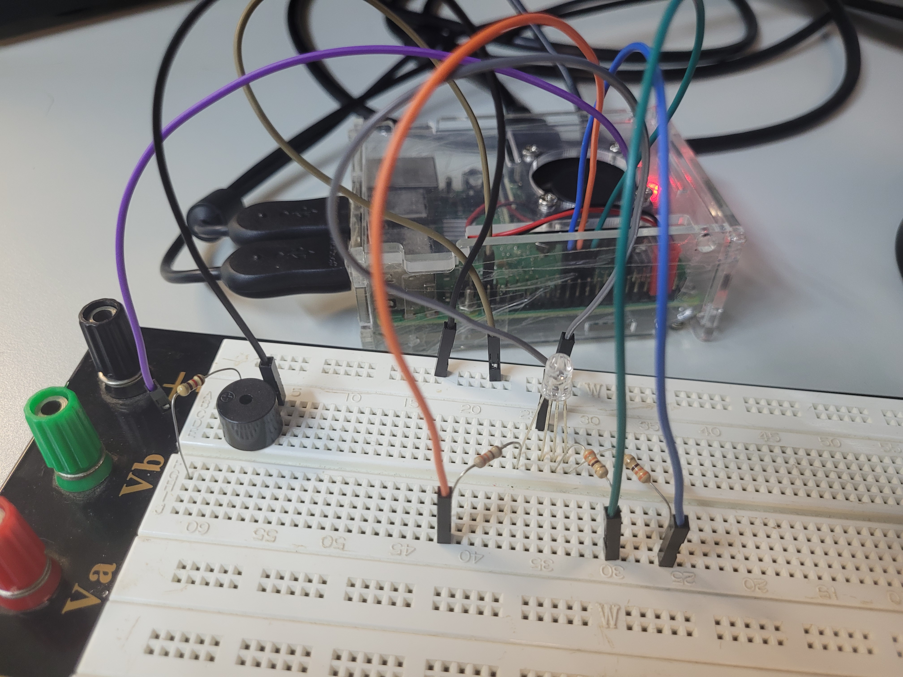

# SEL0337

## Resumo do funcionamento do projeto da Prática 5

A prática descrita visa configurar um sistema de inicialização automática de uma aplicação Python em um sistema embarcado com Linux, utilizando a unidade de serviço `systemd`. O objetivo é garantir que o programa (como um script Python) seja iniciado automaticamente durante o processo de boot, sem a necessidade de intervenção manual após a inicialização do sistema operacional.

A configuração envolve a criação de uma **unidade de serviço personalizada** [```colorblink.service```](https://github.com/fujiska/SEL0337/blob/main/colorblink.service) para gerenciar o processo de inicialização e execução do projeto. A unidade de serviço descreve como o sistema deve iniciar, parar e gerenciar o script Python. No caso dessa prática, um serviço foi configurado para iniciar o script [```colorblink.py```](https://github.com/fujiska/SEL0337/blob/main/colorblink.py) (um programa que faz transições de cores com LEDs RGB) e, quando o serviço for interrompido (via `systemctl stop`), o script [```buzzlightyear.py```](https://github.com/fujiska/SEL0337/blob/main/buzzlightyear.py) (que ativa um buzzer) será executado.

O `systemd` é o sistema de inicialização moderno utilizado no Linux, responsável por gerenciar a inicialização de serviços e processos. A prática envolve a criação de um arquivo de configuração de serviço (`colorblink.service`) que especifica as seguintes ações:

1. **Execução do Script Python:**
   - `ExecStart` define que, ao iniciar o serviço, o script [```colorblink.py```](https://github.com/fujiska/SEL0337/blob/main/colorblink.py) será executado usando o interpretador Python 3.
   - `ExecStop` define que, ao parar o serviço, o script [```buzzlightyear.py```](https://github.com/fujiska/SEL0337/blob/main/buzzlightyear.py) será executado, ativando o buzzer.

2. **Configuração do Sistema:**
   - O serviço é configurado para ser iniciado após o estágio `multi-user.target`, ou seja, após a inicialização de serviços essenciais.
   - A unidade de serviço é associada ao **multi-user.target** no momento da instalação, permitindo que o serviço seja iniciado automaticamente durante o boot.
  
Primeiramente, para que o serviço fosse reconhecido e executado corretamente durante a inicialização do sistema, o arquivo de configuração da unidade de serviço [```colorblink.service```](https://github.com/fujiska/SEL0337/blob/main/colorblink.service) foi colocado no diretório adequado do systemd com o comando `sudo cp colorblink.service /lib/systemd/system/`. Após isso, o serviço pôde ser testado com o comando `sudo systemctl start colorblink`, o qual iniciou o script configurado. Para interromper o serviço, utilizou-se o comando `sudo systemctl stop colorblink`. Além disso, ao executar `sudo systemctl enable colorblink`, o serviço foi configurado para ser iniciado automaticamente a cada reinicialização do sistema. Assim, ao reiniciar a Raspberry Pi, o serviço foi executado automaticamente.

Para solução de problemas, utilizou-se o comando `sudo systemctl status colorblink.service`, que forneceu informações detalhadas sobre o estado do serviço e eventuais mensagens de erro. Para desabilitar o serviço no boot, usou-se o comando `sudo systemctl disable colorblink`, o que impediu que ele fosse iniciado nas reinicializações seguintes. Para todas as alterações feitas no arquivo do serviço, foi necessário recarregar as configurações com `sudo systemctl daemon-reload` para que as modificações fossem aplicadas.

Como resultado do projeto, observa-se a imagem e o vídeo abaixo, que representam o funcionamento do serviço de inicialização acima.

 

Vídeo:
Github - https://github.com/fujiska/SEL0337/blob/main/midia/20241125_172305.mp4
Drive - https://drive.google.com/file/d/1ty-9zj_Xuy1Z0Xztwy3lXKTORBcSBvCc/view?usp=drive_link

O histórico de commits git realizados no terminal durante a aula está presente no arquivo [```historico_git.txt```](https://github.com/fujiska/SEL0337/blob/main/historico_git.txt).
